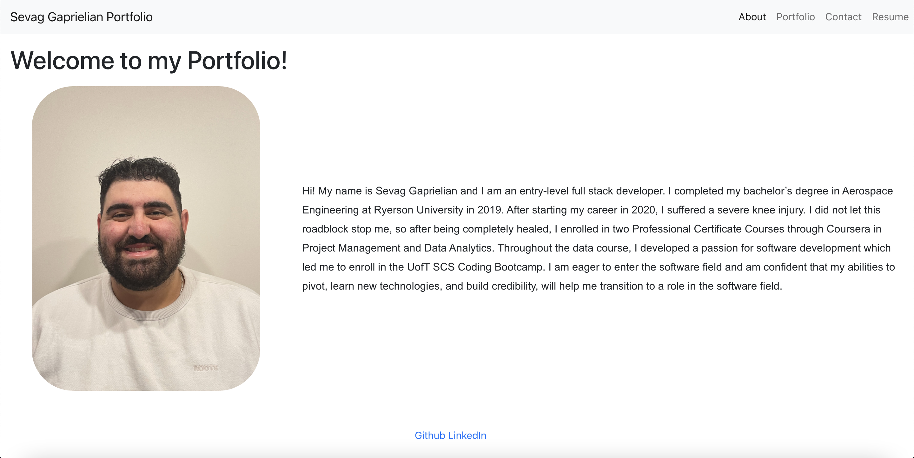
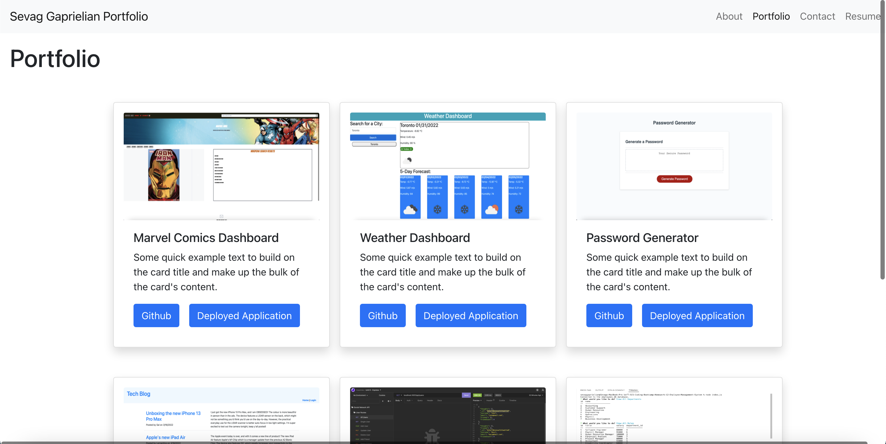
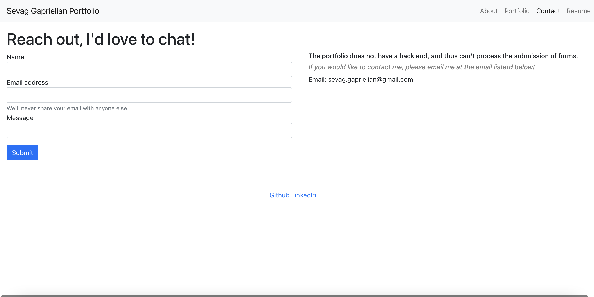
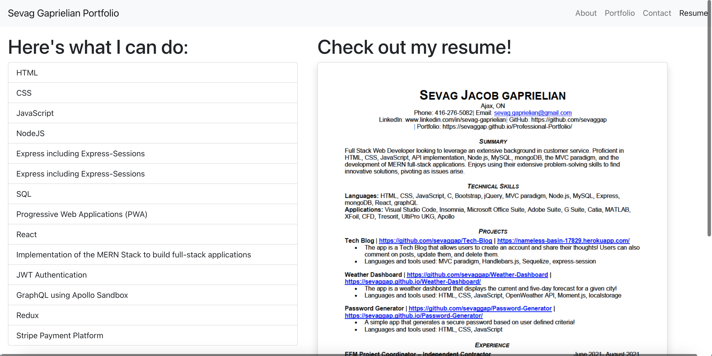

# React Portfolio

## Table of Contents
* [Description](#desc)  
* [Installation](#install)  
* [Usage](#usage)  
* [Credits](#credits)  
* [License](#license)  
* [Github](#github)  

## Description

Being a web developer means being part of a community. You’ll need a place not only to share your projects while you're applying for jobs or working as a freelancer but also to share your work with other developers and collaborate on projects.

The purpose of this project was to create a portfolio using React, which sets me apart from other developers whose portfolios don’t use the latest technologies. The application is also deployed on GitHub Pages. 

## Installation

Follow the deployed link below in the GitHub section!

## Usage
The following image shows the application's appearance and functionality.

The Homepage/About Me page should appear as follows:

The Portfolio page should appear as follows:

The Contact page should appear as follows:

The Resume page should appear as follows:

 
## Credits
Uoft SCS Coding Bootcamp Gitlab

 
## License
Copyright [2022] [Sevag Gaprielian]

Licensed under the Apache License, Version 2.0 (the "License"); you may not use this file except in compliance with the License.
You may obtain a copy of the License at http://www.apache.org/licenses/LICENSE-2.0.

Unless required by applicable law or agreed to in writing, software
distributed under the License is distributed on an "AS IS" BASIS,
WITHOUT WARRANTIES OR CONDITIONS OF ANY KIND, either express or implied.
See the License for the specific language governing permissions and
limitations under the License.

 
## GitHub
Github: sevaggap  
Deployed Application: https://sevaggap.github.io/React-Portfolio/